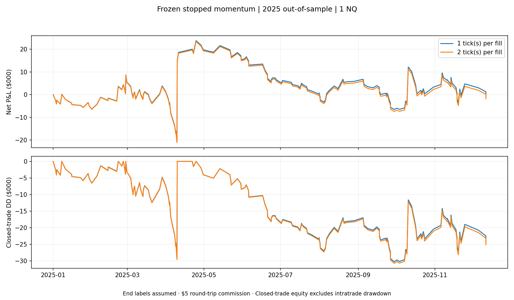

# Systematic Trading Research

An ongoing research project exploring whether intraday futures strategies remain viable after transaction costs, out-of-sample testing, and rule-based risk constraints.

The project focuses on building a repeatable research process rather than maximising historical backtest performance.

## Research Question

Given a trading strategy with uncertain outcomes, how likely is it to:

- remain profitable after realistic transaction costs,
- generalise to unseen data,
- reach a profit target before breaching a drawdown limit,
- remain robust when assumptions and parameters change?

## Current Scope

The current research focuses on intraday Nasdaq-100 futures (NQ).

The workflow includes:

- strategy hypothesis formation,
- historical backtesting,
- development / holdout separation,
- transaction-cost modelling,
- out-of-sample evaluation,
- drawdown and risk analysis,
- simulation under rule-based trading constraints.

## Research Process

The general process is:

1. Formulate a strategy hypothesis.
2. Test the strategy on development data.
3. Include commissions and slippage assumptions.
4. Freeze the selected strategy rules before viewing the holdout period.
5. Evaluate performance on previously unseen data.
6. Investigate risk, robustness, and sensitivity rather than retuning against the holdout.

## Out-of-Sample Result

One momentum-based candidate showed encouraging performance during development.

The strategy rules and code were frozen before evaluating the 2025 holdout period.

The 2025 out-of-sample result was substantially weaker and approximately flat after transaction costs.

Rather than re-optimising the strategy using the holdout period, the result is retained as evidence that the original development performance did not generalise reliably.

This motivates further investigation into:

- regime sensitivity,
- parameter robustness,
- alternative strategy hypotheses,
- position sizing,
- repeated-outcome simulation.



## Repository Structure

```text
systematic-trading-research/
├── src/
│   ├── backtest_open_candle.py
│   ├── test_stopped_strategies.py
│   ├── simulate_stopped_prop.py
│   ├── freeze_momentum_candidate.py
│   ├── run_momentum_oos.py
│   ├── audit_momentum_risk.py
│   ├── prop_simulator.py
│   └── stress_prop_firms.py
│
├── docs/
│   ├── candidate_freeze.md
│   ├── oos_2025_findings.md
│   ├── risk_audit.md
│   └── constrained_simulation.md
│
├── results/
│   ├── development_equity_curves.png
│   ├── oos_equity.png
│   └── risk_audit.png
│
├── requirements.txt
├── .gitignore
└── README.md